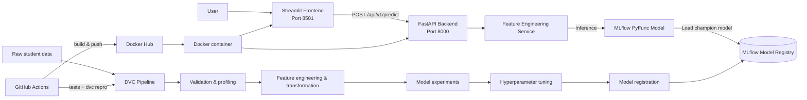

# 🎓 Burnout Compass — Student Burnout Risk Intelligence

> An end-to-end, production-oriented machine learning system that estimates student burnout risk as **Low**, **Medium**, or **High** from academic performance, study habits, AI usage, and wellbeing signals.

[](https://www.python.org/)
[](https://fastapi.tiangolo.com/)
[](https://streamlit.io/)
[](https://mlflow.org/)
[](https://www.docker.com/)

---

## ✨ Why this project?

Student burnout is influenced by more than grades alone. This project turns a mix of academic, behavioural, and AI-adoption signals into a reproducible risk-classification workflow. It demonstrates the full path from data preparation and model selection to a validated API, polished web interface, container delivery, and automated deployment.

### What it solves

- Classifies student burnout risk into **Low**, **Medium**, or **High**.
- Makes inference accessible through a simple Streamlit assessment experience.
- Keeps model training, registration, serving, and deployment independently maintainable.
- Loads the current MLflow **`champion`** registered model at runtime, rather than hard-coding a model artifact into the application.

> **Important:** Predictions are decision-support signals, not a clinical diagnosis or a replacement for professional mental-health support.

---

## 🧰 Tech stack

| Area | Technologies |
| --- | --- |
| Language & data | Python 3.12, Pandas, NumPy, PyArrow |
| Machine learning | scikit-learn, Random Forest, XGBoost, Logistic Regression, GridSearchCV |
| Experimentation & registry | MLflow, Dagshub, model signatures, model aliases |
| Data & reproducibility | DVC, YAML configuration, Pydantic artifacts |
| Backend | FastAPI, Pydantic, Uvicorn |
| Frontend | Streamlit, custom CSS, Requests |
| Delivery | Docker, Docker Compose |
| Automation | GitHub Actions, Docker Hub |
| Quality | Pytest, Ruff |

---

## 🏛️ System architecture

<!-- Replace this Mermaid diagram with the supplied architecture image when available.
     Recommended location: docs/assets/architecture-diagram.png
     Markdown:  -->



### Runtime request flow

1. The container starts FastAPI first.
2. FastAPI loads `models:/burnout_classifier@champion` from the MLflow tracking server.
3. `main.py` waits for `/api/v1/health` before starting Streamlit.
4. Streamlit collects validated user inputs and calls the FastAPI prediction endpoint.
5. The backend creates deterministic engineered features, runs the registered inference pipeline, and returns the risk class.

---

## 🧠 ML pipeline overview

The DVC pipeline is organized into explicit, reproducible stages:

```text
Data ingestion
   → Schema validation
   → Profiling
   → Feature engineering
   → Data transformation
   → Cross-validated model experiments
   → Grid-search tuning of the selected model
   → MLflow Model Registry registration
```

- **Input contract:** academic data, study hours, GenAI usage, perceived dependency, exam anxiety, institutional policy, and skill-retention measures.
- **Feature engineering:** derives GPA change, AI-dependency gap, study efficiency, AI reliance ratio, burnout pressure, and other domain features.
- **Model selection:** compares enabled candidate models using cross-validation and `macro_f1`.
- **Tuning:** performs `GridSearchCV` on the experiment winner and refits it on the training split.
- **Registration:** registers the full preprocessing-plus-classifier pipeline to MLflow with its input signature, sample data, metrics, and `champion` alias.

Run the complete pipeline locally:

```bash
pip install -r requirements.txt
dvc repro model_registry
```

---

## 🌐 Application services

### Frontend — Streamlit

The frontend in `src/frontend` provides a focused assessment form and a polished Low/Medium/High result card.

- Shows a **“Waiting for API to load”** screen until the API and registered model are ready.
- Uses cached HTTP-session resources and short-lived health checks to avoid unnecessary requests.
- Never caches prediction results.
- Configured with `BACKEND_API_URL` (default: `http://127.0.0.1:8000/api/v1`).

### Backend — FastAPI

The backend in `src/backend` is a separate, modular inference layer.

- Validates payloads with strict Pydantic schemas.
- Applies the same deterministic feature-engineering contract used in training.
- Loads the registered MLflow model only once at startup.
- Exposes interactive API documentation at `/docs`.

| Endpoint | Purpose |
| --- | --- |
| `GET /api/v1/health` | Confirms the API and model are available. |
| `POST /api/v1/predict` | Scores one or more validated student records. |

### Container — Docker

One Docker image runs both layers:

- `main.py serve` supervises FastAPI and Streamlit as one application unit.
- Only the Streamlit port (`8501`) is exposed publicly.
- FastAPI remains internal to the container at port `8000`.
- A Docker health check monitors the Streamlit process.

---

## 🗂️ Project structure

```text
burnout_classifier/
├── .github/workflows/
│   └── ci-cd.yml                 # Tests, DVC reproduction, Docker Hub publishing
├── configs/                      # Schemas, experiment and registry configuration
├── data/                         # Raw and processed data (DVC-managed)
├── docs/                         # Project documentation and architecture image location
├── src/
│   ├── backend/                  # FastAPI API, schemas, model-loading service
│   ├── frontend/                 # Streamlit UI, API client, frontend configuration
│   ├── components/               # Reusable pipeline components
│   ├── entity/                   # Typed configuration and artifact contracts
│   ├── experiment/               # Model factory and experiment runner
│   ├── features/                 # Deterministic feature engineering
│   ├── pipeline/                 # DVC stage entry points
│   ├── tracking/                 # MLflow adapter
│   └── validators/               # Dataset schema validation
├── tests/                        # Unit tests for pipeline, API, frontend and startup flow
├── dvc.yaml                      # Reproducible pipeline DAG
├── Dockerfile                    # Single-image deployment
├── docker-compose.yml            # Local container orchestration
├── main.py                       # `serve` and `train` application entry point
├── pyproject.toml                # Python project settings
└── requirements.txt              # Dependencies
```

---

## 🧩 Design principles

- **Separation of concerns:** training, tracking, inference API, and UI live in distinct modules.
- **Reproducibility first:** DVC declares pipeline dependencies and outputs; configuration is versioned in YAML.
- **Training–serving consistency:** the backend reuses the project’s feature-engineering logic and loads the full registered pipeline.
- **Contract-driven interfaces:** Pydantic validates inbound API data and typed artifacts define stage hand-offs.
- **Operational readiness:** health checks, MLflow aliases, environment-based settings, container health monitoring, and CI/CD are built in.
- **User-centered resilience:** the UI waits for model readiness instead of exposing a form that cannot yet be served.

---

## 🐳 Run with Docker

### Option 1: Build locally

```bash
docker build -t burnout-classifier .

docker run --rm -p 8501:8501 \
  -e MLFLOW_TRACKING_URI="https://your-mlflow-server" \
  -e MLFLOW_MODEL_URI="models:/burnout_classifier@champion" \
  burnout-classifier
```

Open [http://localhost:8501](http://localhost:8501). The page shows a waiting state until the model is available.

### Option 2: Docker Compose

```bash
export MLFLOW_TRACKING_URI="https://your-mlflow-server"
export MLFLOW_MODEL_URI="models:/burnout_classifier@champion"
docker compose up --build
```

### Option 3: Pull the published image

```bash
docker pull <dockerhub-username>/burnout-classifier:latest

docker run --rm -p 8501:8501 \
  -e MLFLOW_TRACKING_URI="https://your-mlflow-server" \
  -e MLFLOW_MODEL_URI="models:/burnout_classifier@champion" \
  <dockerhub-username>/burnout-classifier:latest
```

If the MLflow server is protected, also provide its authentication variables such as `MLFLOW_TRACKING_USERNAME` and `MLFLOW_TRACKING_PASSWORD`.

---

## 💻 Local development

```bash
pip install -r requirements.txt

# Start the complete application (FastAPI + Streamlit)
python main.py serve

# Run only the API
uvicorn src.backend.main:app --host 0.0.0.0 --port 8000

# Run only the UI (API must already be available)
streamlit run src/frontend/app.py

# Run tests and linting
python -m pytest -q
ruff check main.py src/backend src/frontend tests
```

The original complete training command remains available as:

```bash
python main.py train
```

---

## 🚀 CI/CD workflow

GitHub Actions in `.github/workflows/ci-cd.yml` provides two levels of automation:

1. **Every push:** install dependencies, lint the application layers, and run the Pytest suite.
2. **`main` pushes or manual dispatch:** restore DVC data, run `dvc repro --force model_registry`, register the updated model, then build and publish Docker Hub images tagged `latest` and `sha-<commit>`.

Add these repository secrets before enabling deployment:

| Secret | Purpose |
| --- | --- |
| `DOCKERHUB_USERNAME` / `DOCKERHUB_TOKEN` | Authenticate Docker Hub image publishing. |
| `DAGSHUB_USER_TOKEN` | Authenticate MLflow/Dagshub experiment tracking and model registration. |
| `DVC_REMOTE_URL` | Location of the DVC-managed data and artifacts. |
| `DVC_REMOTE_USERNAME` / `DVC_REMOTE_PASSWORD` | Optional credentials for protected DVC HTTP remotes. |
| `MLFLOW_TRACKING_URI`, `MLFLOW_TRACKING_USERNAME`, `MLFLOW_TRACKING_PASSWORD` | Optional MLflow server overrides and credentials. |

---

## 📌 Resume highlights

- Built a modular MLOps system for multi-class student burnout-risk prediction.
- Implemented experiment tracking, model signatures, model registry aliases, and runtime MLflow model loading.
- Designed a validated FastAPI inference layer and a readiness-aware Streamlit user experience.
- Containerized the complete application and automated testing, model reproduction, registration, and Docker Hub publishing with GitHub Actions.

---

## 📄 License

Distributed under the [BSD License](LICENSE).
